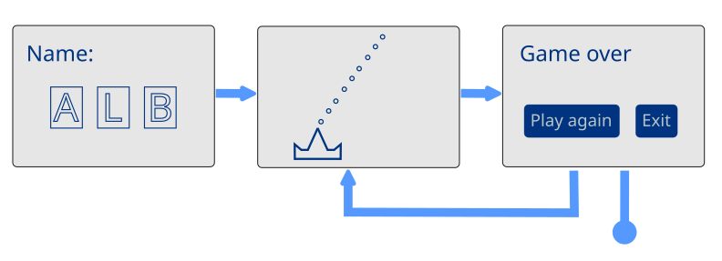

# Game loop design minták

Egy egyszerű játékprogram magas szintű szervezésére tekintünk
át néhány ötletet.

Ahhoz, hogy már érdekes legyen, de még nem túl bonyolult, a
Commodore-os játékvilág egyik sztenderd struktúráját próbáljuk
megvalósítani:

1. Amikor a játék elindul, egy képernyőn bekér pár adatot, és
   egy gombbal el lehet indítani.
2. Utána van maga a játék.
3. Amikor vége van, akkor egy képernyőn be lehet adni pár
   karaktert, és esetleg egy új kört kezdeni, vagy kilépni.

## /01-kulon_kulon - A három képernyő, három külön programban

Ebben a könytárban a játék három fázisa három külön programban van
megírva. A cél szemléltetni, hogy milyen logika kell hozzájuk, és mit
kell majd egy programba összefésülni.

