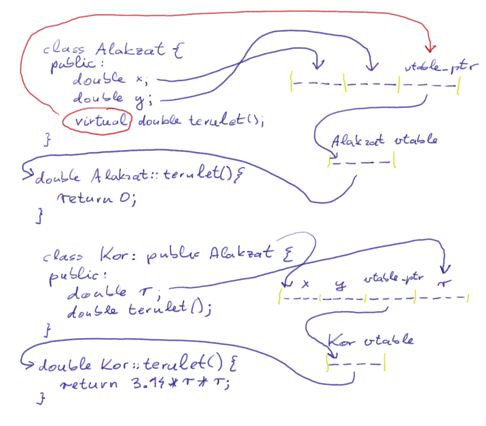

# Leszármazott osztályok példányai vektorban

Ebben a könyvtárban példák egy sorozatán át eljutunk odáig, hogy hogyan
is lehet egy osztály leszármazottait egy vektorban tárolni.

Az elképzelt feladat: a `bemenet.txt`-ben adott egy listája köröknek
és téglalapoknak. Olvassuk őket be egy vektorba, majd menjünk végig a
vektoron, és mindegyik alakzatnak számoljuk ki a területét, és adjuk
össze.

<dl>

<dt>[01_peldany_vektor.cc](./01_peldany_vektor.cc)</dt>
<dd>Az első kísérletünk, egyszerűen készíteni egy vektort a bázis osztályból.
Nem megy, mert a vektorban csak azok a bájtok vannak, amik a bázis osztályban is
benne vannak (hiszen a vektor minden eleme azonos hosszú kell, hogy legyen,
mégpedig akkora, ami az elem-típusának a mérete. Az elem-típus az az, amit a
`<...>` template paraméterben megadtunk neki.) Az
[images/struct-orokles-memoria-lazout.png] mutatja, hogy a `Kor` és a `Teglalap`
elején ott van egy-egy `Alakzat`: na annyi kerül be a vektorba:

</dd>

<dt>[02_pointer_vektor_de_nem_virtualis.cc](./02_pointer_vektor_de_nem_virtualis.cc)</dt>
<dd>A második kísérletünk, hogy a `Kor` és a `Teglalap` adatát hagyjuk valahol
máshol a memóriában (a *heap*-en), és a vektorunkban tartsunk csak pointereket.
Ehhez a `Kor` és a `Teglalap` osztályaink példányait a `new` operátorral a
heap-en foglaljuk le, az pedig visszaad egy pointert a --- most már megfelelő
méretű --- lefoglalt helyre. A pointerek mindig ugyanakkorák, akármekkora
lefoglalt memóriára is mutatnak, ezért pointereket már tehetünk vektorba. Ez már
majdnem jó, a baj csak az, hogy sehol nem tároljuk, hogy melyik pointert hogyan
kell értelmezni. Hiába egy `Kor` vagy egy `Teglalap` van a mutatott helyen, ezt
a pointerből nem látja a gép --- elvégre is a pointer semmi más, mint az adat
helye a memóriában.

</dd>

<dt>[03_virtualisan](./03_virtualisan.cc)</dt>
<dd>Ahhoz, hogy a dolog működjön, kell az is, hogy a program valahogy tudja, hogy
melyik metódus-implementáció tartozik egy adott `Alakzat` példányhoz. Erre való
a `virtual` kulcsszó. Ha legalább egy metódus virtuális, akkor az osztály
memória-reprezentációjában az adattagok mellett van egy pointer, ami egy
úgynevezett *vtable*-re mutat. Az adott osztály *vtable*-jében mutatók vannak
annak az osztálynak a virtuális metódusainak implementációira. Amikor
leszármaztatunk ebből az osztályból, akkor a gyerek osztály példányainak egy
másik *vtable*-re mutat majd ez a mutatójuk. Amikor egy `Alakzat` mutatón
kersztül érünk el egy leszármazottat, mondjuk egy `Kor`-t, akkor pont azt a
`terulet()` metódust hívjuk, amelyiket akartud, mert a `vtable_ptr` az a `Kor`
*vtable*-jére mutat.

</dd>

<dt>[05_virtualis_de_nem_pointer.cc](./04_virtualis_de_nem_pointer.cc)</dt>
<dd>Csábító ötlet kipróbálni, hogy mi történik, ha nem pointereket tárolunk,
de használjuk a `virtual` kulcsszót. Csodát nem tesz: a *memory layout* nagyon
hasonló az elsőhöz, azzal a különbséggel, hogy az `Alakzat` tárol egy
mutatót a `vtable`-jére. Csak sajnos amikor `push_back`-kelünk mondjuk egy
`Kor` objektumot egy `std::vector<Alakzat>`-ra, akkor semmi csoda nem történik:
a vektorban márpedig csak egy `Alakzat`-nak van hely. Nem a `Kor` bájtjai
másolódnak egy-az-egyben, tehát a `Kor` *vtable pointer*-je (szerencsére)
nem másolódik át. A `push_back` hatására konstruálódik egy új `Alakzat`
példány, a *vtable pointer* pedig az `Alakzat` *vtable*-jére
fog mutatni. Tehát a `Kor`-ünk a `push_back` pillanatában visszaváltozik
egy `Alakzat`-tá, és minden afölötti tulajdonsága eltűnik.

</dd>

<dt>[06_union_tipus.cc](./06_union_tipus.cc)</dt>
<dd>Természetesen lehetséges olyan vektort készíteni, amelyben helyben belefér
egy `Kor` és egy `Teglalap` is. Ami nem lehetséges: olyan vektort készíteni,
amelybe az `Alakzat` bármilyen leszármazottja belefér, hiszen előre nem
tudhatjuk, hogy mekkora a legnagyobb --- nincs is olyan, hogy legnagyobb,
mindig készíthetünk egy még nagyobb leszármazottat, még több adattaggal.

</dd>

</dl>

